  <picture>
    <source media="(prefers-color-scheme: dark)" srcset="dark.svg">
    
  </picture>

  <b>Full-Stack Developer · Agentic AI Developer · DevOps</b>

  
  
  

---

## About Me

<picture>
  <source media="(prefers-color-scheme: dark)" srcset="divider-dark.svg">
  
</picture>

Hi there! I'm **Syeda Noor Fatima** — a passionate full-stack developer and
agentic-AI enthusiast based in **Karachi, Pakistan**, currently pursuing a
Bachelor's in Computer Science while freelancing and working professionally.
I love turning complex problems into clean, animated, and delightful software
— from dithered SVG art to AI-powered agents and resilient cloud deployments.

- 🔭 I'm currently working on **full-stack applications, agentic AI systems, and DevOps automation**
- 🌱 I'm currently learning **advanced LLM orchestration, system design, and cloud-native patterns**
- 💬 Ask me about **Python, JavaScript, FastAPI, React, Docker, and AI agents**
- 📫 Reach me: **syedanoorfatima610@gmail.com**
- ⚡ Fun fact: I design my own animated GitHub assets with a tiny Python pixel pipeline

---

## Currently Working On

<picture>
  <source media="(prefers-color-scheme: dark)" srcset="divider-dark.svg">
  
</picture>

- 🚀 Freelancing projects: full-stack web apps for real clients
- 🤖 Agentic AI prototypes: multi-agent workflows and tool-calling systems
- ☁️ DevOps: containerized deployments, CI/CD pipelines, and self-hosted services
- 🎨 This very profile — dithered banners, self-hosted stats, and the daily snake

  
<b>📚 Now Learning</b>

  - Advanced RAG & LLM orchestration (LangChain, OpenAI Agents)
  - Cloud-native deployment (Docker, Kubernetes, Terraform)
  - System design & scalable architecture
  - Clean, testable full-stack patterns (FastAPI + React + PostgreSQL)

---

## Languages & Tools

<picture>
  <source media="(prefers-color-scheme: dark)" srcset="divider-dark.svg">
  
</picture>

### Languages

### Frontend

### Backend

### Mobile

### Databases

### Cloud & DevOps

### AI/ML

### Tools & IDEs

<!-- Badges generated by scripts/gen_badges.py (validated against simple-icons) -->

---

## GitHub Stats

<picture>
  <source media="(prefers-color-scheme: dark)" srcset="divider-dark.svg">
  
</picture>

  <picture>
    <source media="(prefers-color-scheme: dark)" srcset="https://grs-XXXX.vercel.app/api?username=SyedaFatimaNoor&show_icons=true&count_private=true&theme=transparent&bg_color=0A101F&title_color=22D3EE&icon_color=10B981&text_color=CBD5E1&border_color=1E293B&hide_title=true">
    
  </picture>
  <picture>
    <source media="(prefers-color-scheme: dark)" srcset="https://grs-XXXX.vercel.app/api/streak-stats?username=SyedaFatimaNoor&theme=transparent&background=0A101F&ring=22D3EE&fire=10B981&currStreakNum=CBD5E1&sideNums=CBD5E1&currStreakLabel=22D3EE&sideLabels=CBD5E1&dates=CBD5E1&border=1E293B">
    
  </picture>

<picture>
  <source media="(prefers-color-scheme: dark)" srcset="https://github-readme-activity-graph.vercel.app/graph?username=SyedaFatimaNoor&theme=react-dark&bg_color=0A101F&color=22D3EE&line=10B981&point=A78BFA&hide_border=true">
  
</picture>

> **Note**: Replace `grs-XXXX` with your own Vercel instance URL after
> self-hosting `github-readme-stats` (see `scripts/README` or the master
> prompt, Phase 3). Stats, streak, and pin cards then run entirely from your
> own instance.

---

## Featured Projects

<picture>
  <source media="(prefers-color-scheme: dark)" srcset="divider-dark.svg">
  
</picture>

<!-- TODO: replace the four repo names below with your real pinned repos -->

  <picture>
    <source media="(prefers-color-scheme: dark)" srcset="https://grs-XXXX.vercel.app/api/pin?username=SyedaFatimaNoor&repo=repo-1&theme=transparent&bg_color=0A101F&title_color=22D3EE&icon_color=10B981&text_color=CBD5E1&border_color=1E293B&show_owner=true">
    
  </picture>
  <picture>
    <source media="(prefers-color-scheme: dark)" srcset="https://grs-XXXX.vercel.app/api/pin?username=SyedaFatimaNoor&repo=repo-2&theme=transparent&bg_color=0A101F&title_color=22D3EE&icon_color=10B981&text_color=CBD5E1&border_color=1E293B&show_owner=true">
    
  </picture>

  <picture>
    <source media="(prefers-color-scheme: dark)" srcset="https://grs-XXXX.vercel.app/api/pin?username=SyedaFatimaNoor&repo=repo-3&theme=transparent&bg_color=0A101F&title_color=22D3EE&icon_color=10B981&text_color=CBD5E1&border_color=1E293B&show_owner=true">
    
  </picture>
  <picture>
    <source media="(prefers-color-scheme: dark)" srcset="https://grs-XXXX.vercel.app/api/pin?username=SyedaFatimaNoor&repo=repo-4&theme=transparent&bg_color=0A101F&title_color=22D3EE&icon_color=10B981&text_color=CBD5E1&border_color=1E293B&show_owner=true">
    
  </picture>

---

## Random Dev Quote

<picture>
  <source media="(prefers-color-scheme: dark)" srcset="divider-dark.svg">
  
</picture>

  

---

## Contribution Snake

<picture>
  <source media="(prefers-color-scheme: dark)" srcset="divider-dark.svg">
  
</picture>

<picture>
  <source media="(prefers-color-scheme: dark)" srcset="https://raw.githubusercontent.com/SyedaFatimaNoor/SyedaFatimaNoor/output/github-contribution-grid-snake-dark.svg">
  
</picture>

---

## More About Me

<picture>
  <source media="(prefers-color-scheme: dark)" srcset="divider-dark.svg">
  
</picture>

- 🎓 Bachelors in Computer Science — ongoing
- 💼 Freelancing + office work, bridging client needs and clean engineering
- 🌍 Based in Karachi, Pakistan (working with teams worldwide)
- 🧠 Interests: agentic AI, generative art, self-hosted tooling, open source
- 🛠️ Every badge above is verified; this README has zero broken images

---

## Connect With Me

<picture>
  <source media="(prefers-color-scheme: dark)" srcset="divider-dark.svg">
  
</picture>

  
  
  
  
  
  

  

